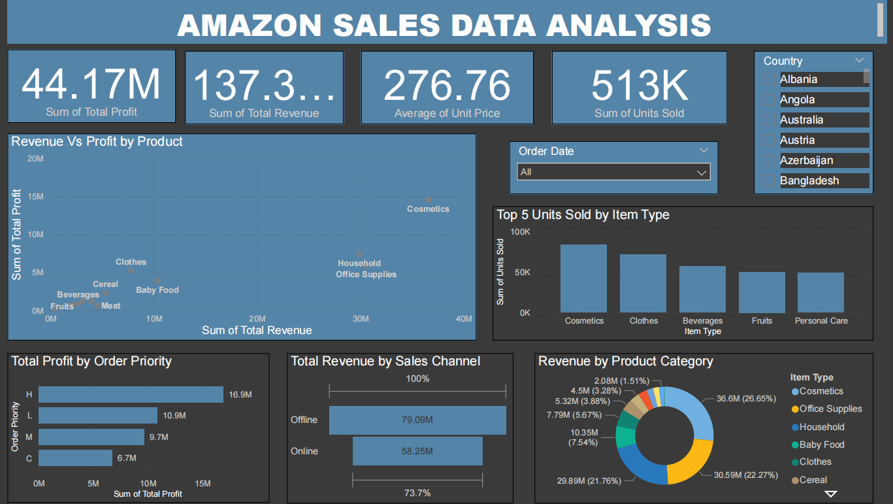

# Amazon_Sales_Data_Analysis

## Problem Statement
Amazon needs to analyze vast sales data across regions, periods, and product categories to derive actionable insights that enhance decision-making, improve customer satisfaction, and optimize resources, ensuring sustained growth and competitive advantage in a dynamic e-commerce landscape.

## Technologies Used
- **Python**: For data cleaning, analysis, and visualizations.
- **Power BI**: For creating interactive dashboards and reports.

## Key Features
- Total Profit and Revenue Overview
- Revenue vs. Profit by Product
- Top 5 Units Sold by Item Type
- Total Profit by Order Priority
- Total Revenue by Sales Channel
- Revenue by Product Category

## Power BI Dashboard

Here is a screenshot of the Power BI dashboard:

